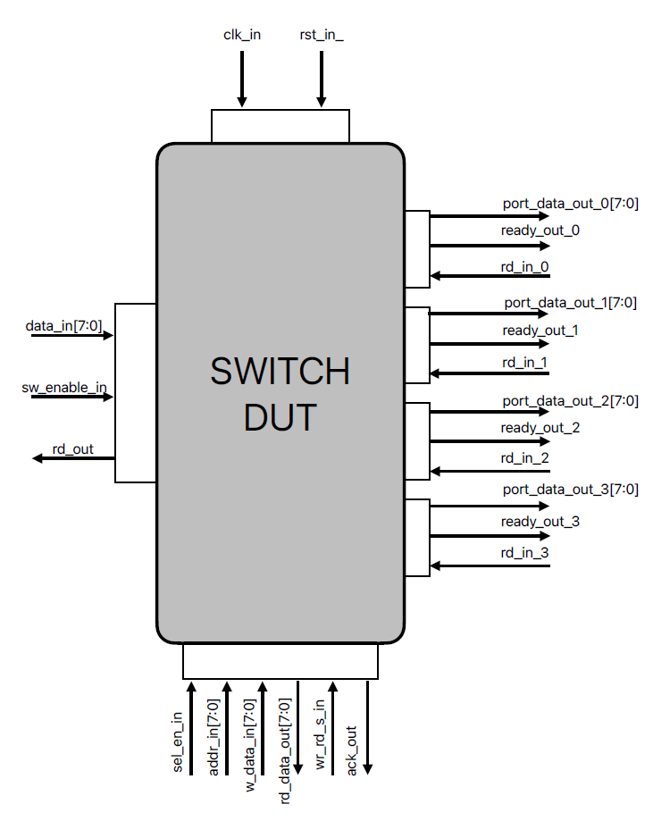
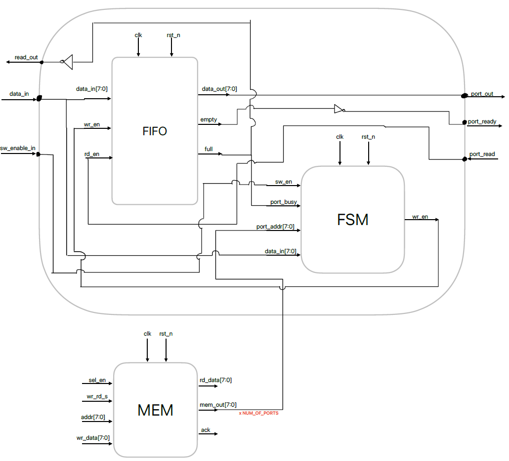

# cluster-lvl-switch-uvm-tb
 
Welcome to the Simple Cluster Switch DUT TB!

**
    To be completed with cluster information
**

## Unit level description

The Switch design is capable of driving incoming packets to 4 different ports.

The packet enters trough the input interface byte after byte and is stored in one of the internal FIFOs corresponding to each port.
Each port has an address configurable trough the memory interface. 
For the packet to arrive to a specific port, the DESTINATION ADDRESS(DA) should be the same as the port address.

A packets has the following frame (the frame is valid for both input and output of the SWITCH):

|====================================================================================|
|   Destination Address     |   Source Address  |   Data Length |   Payload Data     |
|           8 b             |         8 b       |       8 b     |       0-255 B      |
|====================================================================================|

### Input Interface

- the packet enters trough the data_in[7:0] bus, byte after byte
- each byte is valid onlyif the sw_enable_in is set on high
- rd_out is a signal designed for enabeling the read from previous switch ports.
- rd_out is high while the FIFO's are not FULL

### Output Interface

- the port first sets the ready output, signaling that data is ready for read
- next clock cycle should the read signal arrive
- in the clock cycle after the read signal arrives, the data is driven on port_data_out_x[7:0] bus byte after byte, while the read and ready signals are set.

### Memory Interface

- a write transaction happens when in same clock cycle, the sel_en is set, the address and data is available and the wr_rd_s_in strobe is high
- ack_out for a write transaction is provided next clock cycle

- a read transaction happens when in same clock cycle, the sel_en is set, the address is available and the wr_rd_s_in strobe is low.
- the data read will be visible next clock cycle on rd_data_out, togheter with the corresponding ack_out

